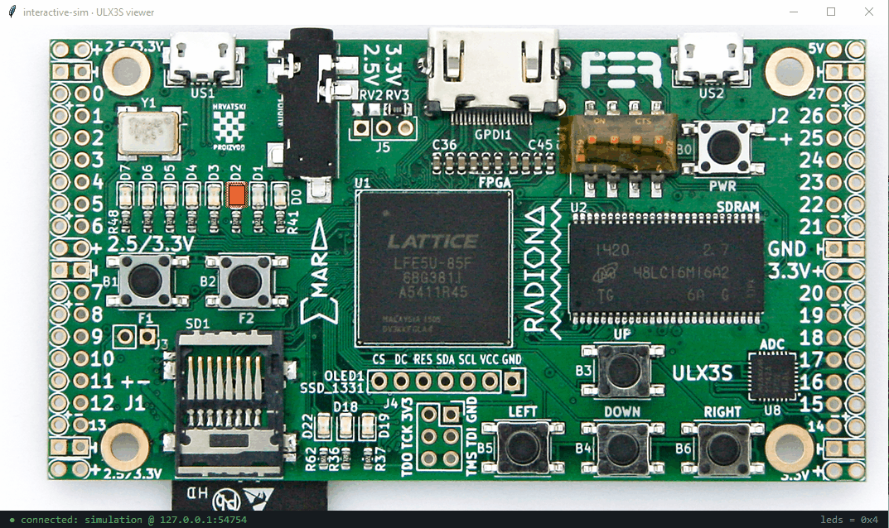

# fpga-isv: Interactive Sim Viewer

A cross-platform **graphical panel viewer** for
[interactive-sim](https://github.com/DFiantWorks/interactive-sim). It draws a board *photo* (or a
blank *panel* you mock up), overlays the LEDs and buttons at their pixel positions, and connects
that virtual panel to a running HDL simulation: **design-driven flags light the LEDs**, and
**clicking a button feeds a control back into the design**.

`fpga-isv` is a *pure client of the interactive-sim socket API* and knows nothing about HDL or
simulators. Anything that speaks the same newline-delimited-JSON protocol works with it. The
[ULX3S](https://github.com/ulx3s/ulx3s) board ships as the bundled reference example.

```sh
fpga-isv --example ulx3s
```



## How it connects

The viewer **listens** on a TCP port; the simulation **connects to it** (set
`INTERACTIVE_STREAM=host:port` for the sim). This means you can:

- **open and close the viewer at any time**, and the sim's backend keeps reconnecting;
- **stop or restart the simulation** while the viewer stays up. On each (re)connect the sim
  replays its full state (every component plus last values), so the panel repopulates automatically.

```sh
fpga-isv --example ulx3s --host 0.0.0.0 --port 7777
# then run a simulation with INTERACTIVE_STREAM=127.0.0.1:7777
```

## Install

Three ways, depending on whether you have Python:

| Method | Command | Needs |
|--------|---------|-------|
| **Standalone binary** (zero prereqs) | download from [Releases](https://github.com/DFiantWorks/interactive-sim-viewer/releases) | nothing |
| **pipx** (Python users) | `pipx install fpga-isv` | a Python that ships `tkinter` |
| **Homebrew** (macOS / Linux) | `brew tap DFiantWorks/fpga-isv https://github.com/DFiantWorks/homebrew-fpga-isv && brew install fpga-isv` | Homebrew |

The standalone binary bundles its own Python, Tcl/Tk, and Pillow, so it runs with no
prerequisites. `pipx` and source installs need a Python with `tkinter` (stdlib, but a separate OS
package on some Linux distros, e.g. `apt install python3-tk`); Pillow is pulled in automatically
and is required for JPEG photos and cropped or non-integer-scaled images (PNG/GIF panels work on
stdlib Tk alone).

> **macOS note:** the released binaries are currently **unsigned**. Launched by another process
> directly they run fine; launched via Finder/`open` from a browser-downloaded copy, Gatekeeper
> blocks them until you clear quarantine: run `xattr -dr com.apple.quarantine ./fpga-isv`, or
> right-click then Open once. **Homebrew** installs strip quarantine, so `brew install` avoids the
> prompt entirely, and `pipx` has no binary to quarantine.

## Config

A panel is described by one JSON file. All coordinates are in **original-image pixels**.
`image.scale` scales the photo/panel and every coordinate together for display, and `image.crop`
trims a photo to the board. The map stays in original-image pixels, so it is independent of crop
and window size.

A **photo** panel:

```jsonc
{
  "title": "ULX3S",
  "image":  { "url": "board.png", "crop": [160, 195, 1650, 1010], "scale": 0.72 },
  "leds":   { "on_color": "#ff5a36", "shape": "rect", "w": 26, "h": 32,
              "items": [ { "name": "leds", "bit": 0, "x": 632, "y": 480 }, /* ... */ ] },
  "buttons":[ { "name": "btn_pwr", "shape": "circle", "x": 1375, "y": 401, "r": 42, "key": "p" } ]
}
```

A **blank panel** mockup (no photo; lay controls out from scratch):

```jsonc
{
  "title": "My Panel",
  "image":  { "width": 1200, "height": 800, "bg": "#101418" },
  "leds":   { "on_color": "#56d364", "items": [ { "name": "led_err", "bit": 0, "x": 100, "y": 80 } ] },
  "buttons":[ { "name": "btn_run", "shape": "rect", "x": 200, "y": 300, "w": 120, "h": 60, "toggle": true } ]
}
```

- `image.url` may be a remote URL (optionally with `cache`), an absolute path, or a path
  **relative to the config file**. Use `width`/`height`/`bg` instead of `url` for a blank panel.
- An LED **item** lights when bit `bit` of flag `name` is `1`, so an N-bit bus is N items with
  different bit indices and a 1-bit flag is one item.
- The `leds` group's `on_color`, `shape`, `w`/`h`, `r`, and `active_state` are defaults; any item
  can override them (e.g. `"on_color": "#00ff00"`) to give individual LED indices their own color,
  geometry, or polarity.
- A **button** sends `1` on press and `0` on release (momentary); `"toggle": true` flips and
  latches. `"key"` mirrors it to a keyboard key (Tk keysym, e.g. `p`, `space`, `Up`).
- **`active_state` sets what a high bit (`1`) means.** For an **LED** it is `"on"` (default; `1`
  lights it) or `"off"` (active-low; `0` lights it). For a **button** it is `"pressed"` (default;
  press sends `1`, release `0`) or `"released"` (active-low; press sends `0`, release `1`, so the
  wire idles high until pressed).

### Mapping a new photo

Run with `--calibrate` and click the image: each click prints the original-image pixel coordinate
(and marks it on the canvas), so you can read off the x/y for every LED and button.

```sh
fpga-isv --config my_board.json --calibrate
```

## CLI

```
fpga-isv (--example NAME | --config PATH) [--host 0.0.0.0] [--port 7777] [--refresh] [--calibrate]
fpga-isv --list-examples
fpga-isv --version
```

## Wire protocol

Newline-delimited JSON, one message per line (defined by interactive-sim; every sim to viewer
message carries `t`, the simulation time in µs):

```
sim    -> viewer   {"ev":"reg",  "t":1234.5,"name":"btn_run","kind":"ctrl","width":1}
                   {"ev":"flag", "t":1234.5,"name":"leds","val":42}
                   {"ev":"time", "t":1234.5}
                   {"ev":"close","t":1234.5,"name":"btn_run"}
viewer -> sim      {"name":"btn_run","val":1}
```

## Develop

```sh
pip install -e . pytest
python -m pytest -q            # headless protocol/config/geometry tests
python -m fpga_isv --example ulx3s
pyinstaller packaging/fpga_isv.spec   # build the standalone binary into dist/
```

## License

MIT (see [LICENSE](LICENSE)). The bundled ULX3S photo is from the
[ULX3S project](https://github.com/ulx3s/ulx3s).
